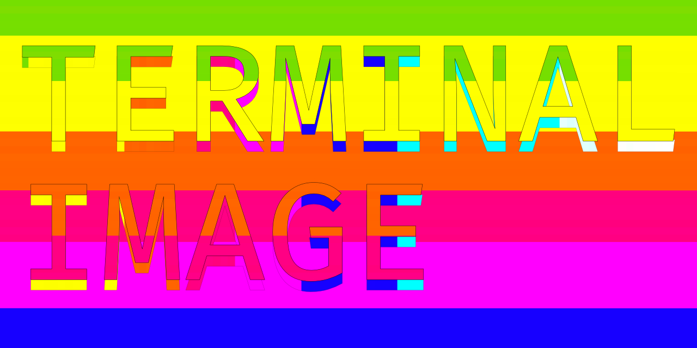
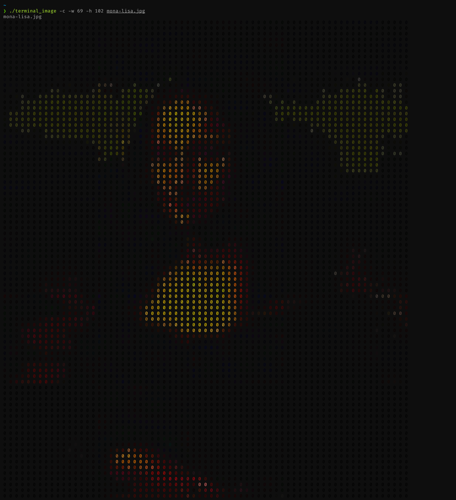
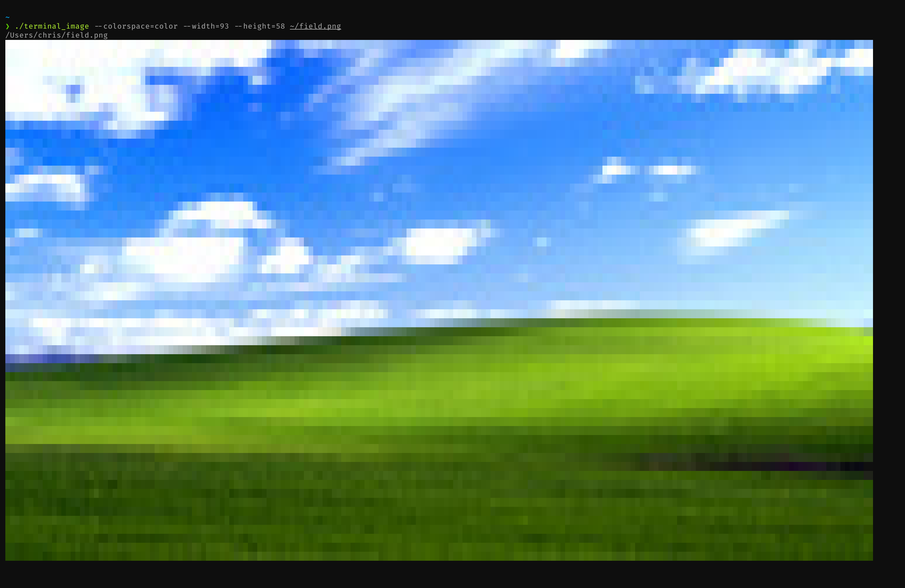
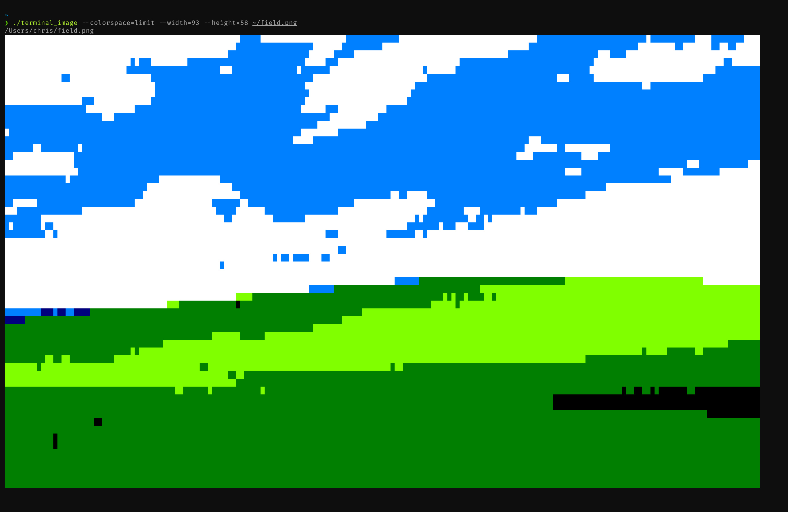
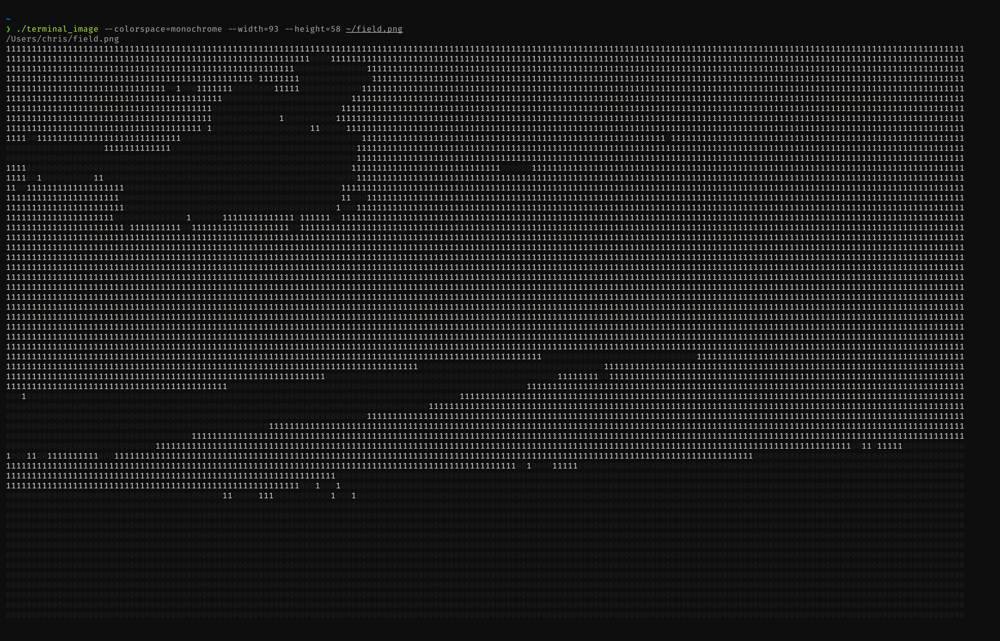
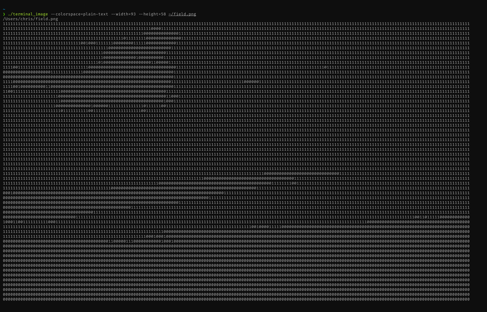

# Terminal Image

[](https://travis-ci.org/chriswmartin/terminal_image)



terminal_image is a terminal image viewer that can display images in a variety of different formats including full-color, monochrome, and plain-text

---




## Dependencies

### [ImageMagick 7](https://github.com/ImageMagick/ImageMagick) & [Libmagic](https://github.com/file/file)

OSX
```bash
brew install imagemagick libmagic
```
Ubuntu
```bash
# compile the latest imagemagick from source
wget https://www.imagemagick.org/download/ImageMagick.tar.gz
tar xvzf ImageMagick.tar.gz
cd ImageMagick-7*
./configure
make && sudo make install
sudo ldconfig /usr/local/lib

sudo apt install libmagic
```
Arch Linux
```bash
# libmagic is pre-installed so you only need to install imagemagick
sudo pacman -S imagemagick
```

## Building

```bash
cd terminal_image
make
```

## Usage

Run terminal_image with any number of images as arguments.  
You may specify 'color', 'limit', 'monochrome', or 'plain-text' output using the --colorspace flag and can manually set output dimensions by passing values to the --width and --height flags.  
By default terminal_image will display images in [24-bit color](https://gist.github.com/XVilka/8346728) at a size scaled to fit your currrent terminal window dimensions.  

```bash
USAGE:
terminal_image [options] [image]

--width, -w <number>
     set width of output, must be used in conjunction with --height

--height -h <number>
     set height of output, must be used in conjunction with --width

--colorspace, -c <color|limit|monochrome|plain-text>
     set colorspace of output
     possible values:
          color: 24-bit True Color (default)
          limit: displays the image using a limited color palette
          monochrome: represents image using black '0's for dark areas and white '1's for light areas
          plain-text: the same as monochrome but the '0's and '1's are not colored

terminal_image [image]                                                                   # display an image in color scaled to fit your terminal window
terminal_image --colorspace=color --width=10 --height=10 [image 1] [image 2] [image 3]   # display multiple images in color at 10x10 scale
terminal_image --colorspace=monochrome --width=50 --height=50 [image]                    # display an image in monochrome mode at 50x50 scale
```

## Examples

### Color Mode


### Limit Mode


### Monochrome Mode


### Plain-text Mode

