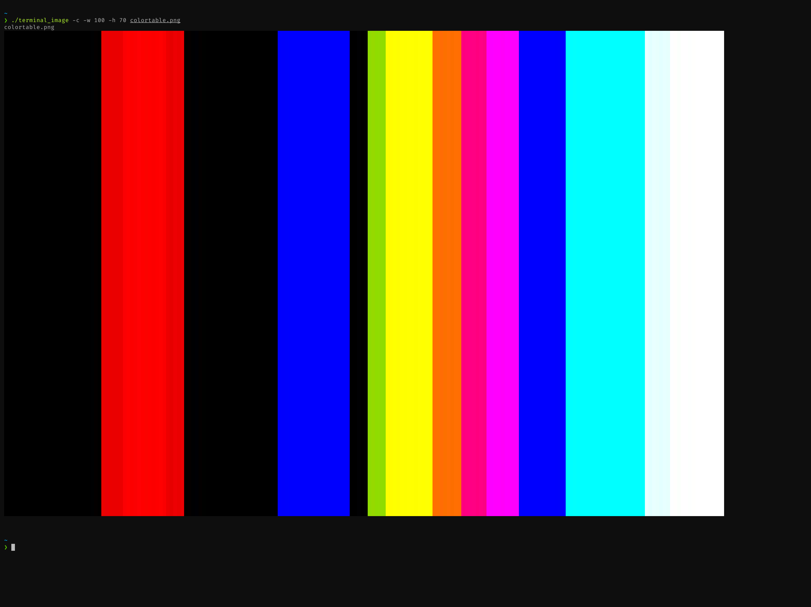

# Terminal Image




## Requirements

### [ImageMagick](https://github.com/ImageMagick/ImageMagick)

OSX
```bash
brew install imagemagick
```
Ubuntu
```bash
apt install imagemagick
```
Arch Linux
```bash
pacman -S imagemagick
```

## Building

```bash
cd terminal_image
make
```

## Usage

Run terminal_image with any number of images as arguments. You may specify enable 'color', 'monochrome', or 'plaintext' output using the --colorspace flag and using the --width and --height flags you can alter the output dimensions. By default terminal_image will display input images in color at a size scaled to fit your currrent terminal window dimensions.

```bash
terminal_image img                                                        # display an image in color scaled to fit your terminal window
terminal_image --colorspace=color --width=10 --height=10 img1 img2 img2   # display multiple images in color at 10x10 scale
terminal_image --colorspace=monochrome --width=50 --height=50 img         # display an image in monochrome mode at 50x50 scale
```
