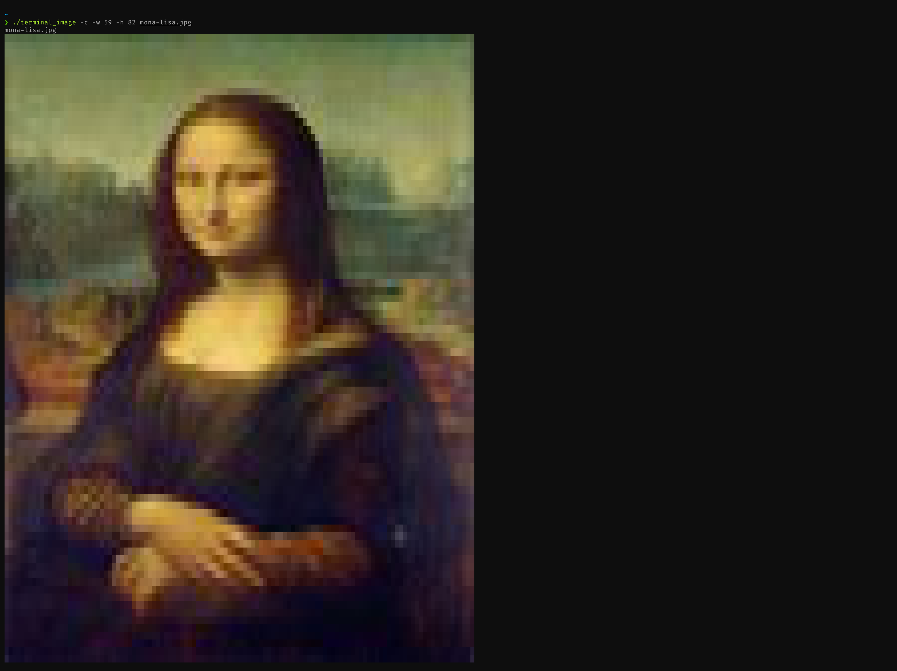
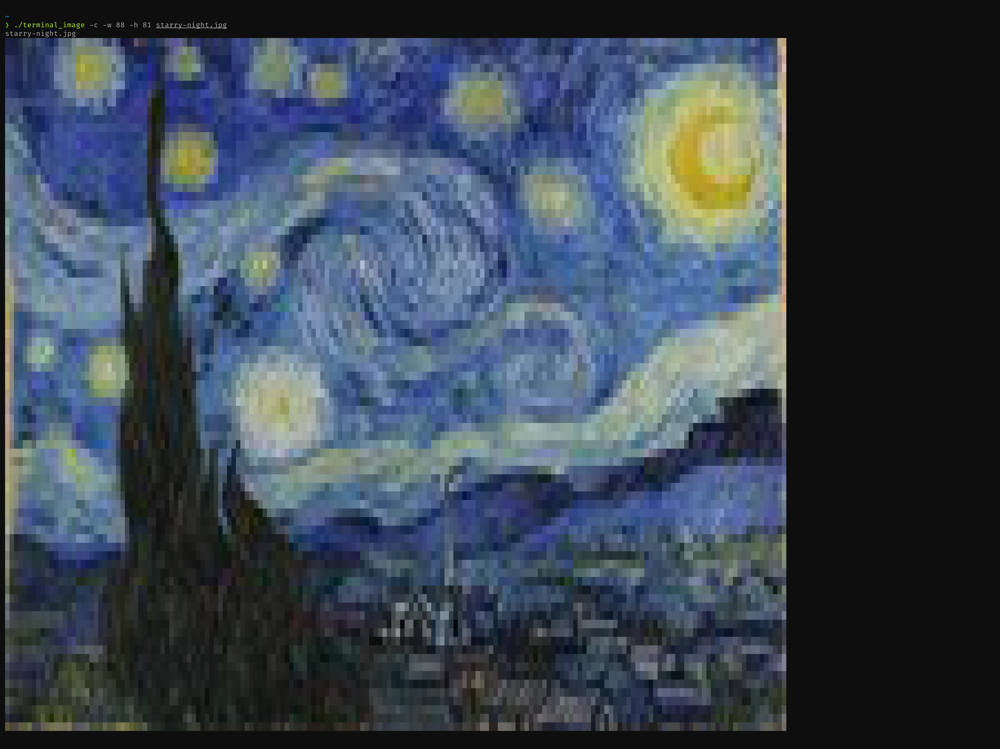

# Terminal Image






## Requirements

### [ImageMagick](https://github.com/ImageMagick/ImageMagick)

OSX
```ShellSession
$ brew install imagemagick
```
Ubuntu
```ShellSession
$ apt install imagemagick
```
Arch Linux
```ShellSession
$ pacman -S imagemagick
```

## Building

```ShellSession
$ cd terminal_image
$ make
```

## Usage

Run terminal_image with any number of images as arguments. Additionally you may enable monochrome mode with the -m flag and provide width and height values to alter the output dimensions using the -w and -h flags. By default terminal_image will display input images in color at a size scaled to fit your currrent terminal window dimensions.

```ShellSession
$ ./terminal_image -w [width] -h [height] img1 img2 img2 ...
```
